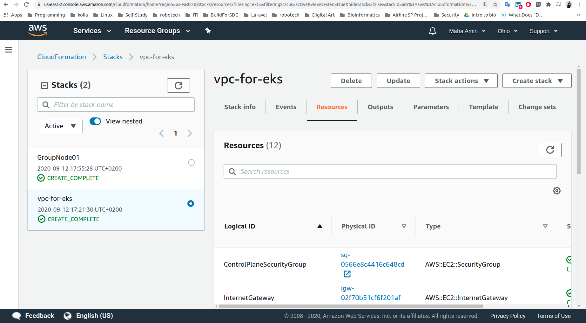

# Udacity Capstone Project 


## Project Steps

- **Development:**

    Simple flask application.

<br>

- **Docker Containerization (Local manual check):**

    Run docker flask-app container:

    ```
        $./run_docker.sh
    ```

<br>

- **Push docker image to docker-hub (Local manual check):**

    ```
        $./upload_docker.sh
    ```


- **Setup Jenkins Server with Blue Ocean on AWS:** 

    - Install java:
    ```
    $ sudo apt update && sudo apt install default-jdk;
    ```

    - Install Jenkins.

    - Install pip3 and venv:
        ```
        $ sudo apt install python3-pip
        ```
        ```
        $ sudo apt-get install python3-venv
        ```

    


- **Docker With Jenkins:**

    - Install docker on jenkins server.

    - Add jenkins to docker group:
        ```
        $ sudo usermod -aG docker jenkins
        ```

    - Install "Docker" jenkin's plug-in.

    - Add Docker-Hub credentials to jenkins.

    - Use docker plug-in to build, upload, and delete docker images.


- **EKS IAM Management:**
    - Create **EKS-Admin** policy: Full access on EKS.
    - Create **EKS-Admins** IAM group.
    - Create **eks-admin** IAM user and add it to **EKS-Admins** IAM group.
    - Download Access and Secret-Access keys.
    - Create credentials for eks-admin on jenkins server.
    
- **Create Kubernetes "Production" Cluster on AWS using EKS: (Tools installed locally)**

    - Follow this [guide](https://docs.aws.amazon.com/eks/latest/userguide/getting-started-eksctl.html).

    - Install AWS CLI.
    - Install eksctl.
    - Install kubectl.
    - Create Amazon EKS cluster:
        1. Create an AWS IAM service role:

        

        2. Create Network (VPC,Subnets,SecurityGroups,InternetGateway,RouteTables) to deploy the cluster using **CloudFormation/amazon-eks-vpc-sample.yaml**

        

        

        3. Create AWS EKS Cluster:

        

        4. Configure kubectl for Amazon EKS:

        ```
        $ aws eks --region us-east-2 update-kubeconfig --name production
        ```

        ```
        kubectl config current-context
        ```

        

        5. Create worker nodes to join kubernetes cluster using **CloudFormation/amazon-eks-nodegroup.yaml**:

        

        
        

        6. Enable the worker nodes to join cluster using **k8s/aws-auth-cm.yaml**: 

        ```
        kubectl apply -f ~/.kube/aws-auth-cm.yaml
        ```

        check nodes :

        ```
        kubectl get nodes
        ```

        
        

        7. Test deploying flask-app on the production cluster outside pipeline:

        ```
        kubectl apply -f k8s/blue-deployment.yaml 
        ```

        ```
        kubectl apply -f k8s/service.yaml 
        ```

        ```
        kubectl get all
        ```

        

        Access the app from browser:

        
    